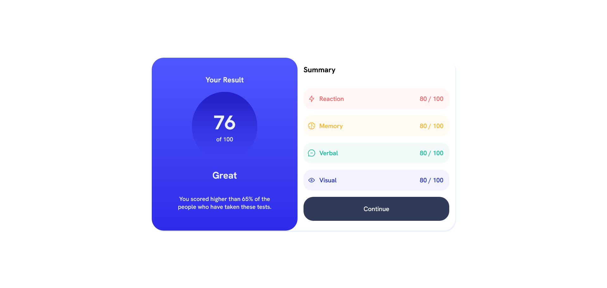

# Frontend Mentor - Results summary component solution

This is a solution to the [Results summary component challenge on Frontend Mentor](https://www.frontendmentor.io/challenges/results-summary-component-CE_K6s0maV). Frontend Mentor challenges help you improve your coding skills by building realistic projects. 

## Table of contents

- [Overview](#overview)
  - [The challenge](#the-challenge)
  - [Screenshot](#screenshot)
  - [Links](#links)
- [My process](#my-process)
  - [Built with](#built-with)
  - [What I learned](#what-i-learned)
  - [Continued development](#continued-development)
- [Author](#author)

## Overview

### The challenge

Users should be able to:

- View the optimal layout for the interface depending on their device's screen size
- See hover and focus states for all interactive elements on the page
- Use the local JSON data to dynamically populate the content

### Screenshot

### Links

- Solution URL: [Add solution URL here](https://result-summary-henna.vercel.app/)
- Live Site URL: [Add live site URL here](https://your-live-site-url.com)

## My process

### Built with

- Semantic HTML5 markup
- SCSS
- Flexbox

### What I learned

First project I used scss, and learned a lot. Still a lot to do with it of course, if you have suggestions, please tell me I want to learn as much as I can about front end.

### Continued development

I want to improve and use scss functions on this project

## Author

- LinkedIn - [@EduardoCastro] https://www.linkedin.com/in/eduardo-castro-0bb28973/
- Frontend Mentor - [@EduardoLimaCastro](https://www.frontendmentor.io/profile/EduardoLimaCastro)
- GitHub - [@EduardoLimaCastro](https://github.com/EduardoLimaCastro)

